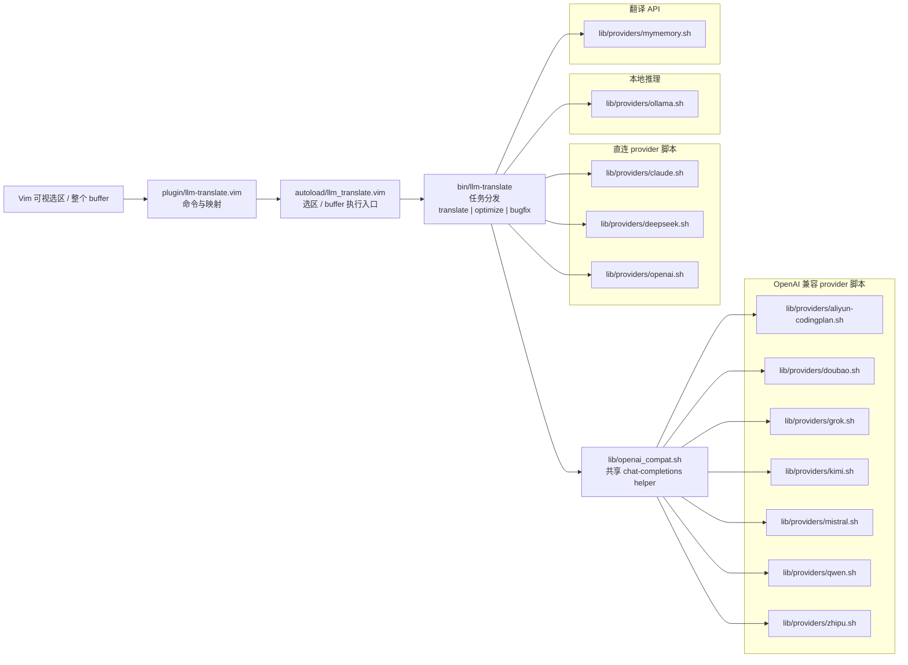

# llm-translate

[English](./README.md) · 简体中文

一个给终端和 Vim 用的轻量工具，底层由大语言模型驱动。单一 CLI、三个任务 ——
**translate**（翻译文本）、**optimize**（优化代码）、**bugfix**（修常见 bug） ——
可切换的 provider（**DeepSeek**、**OpenAI**、**Anthropic Claude**、本地
**Ollama**、**阿里云 Coding Plan**，以及零配置的 **MyMemory** 用于翻译）。
配套的 Vim 插件可以对当前选区或整个 buffer 跑任意一个任务。

```text
┌─────────────────┐     ┌──────────────────────────┐     ┌────────────────────────────────────┐
│ vim 可视选区    │ ──▶ │ llm-translate (CLI)      │ ──▶ │ provider 后端                     │
│ 或整个 buffer   │     │ 任务: translate          │     │ openai_compat:                     │
│                 │     │       optimize           │     │   aliyun-codingplan, doubao,      │
│                 │     │       bugfix             │     │   grok, kimi, mistral, qwen,      │
│                 │     │                          │     │   zhipu                            │
│                 │     │                          │     │ 直连/本地: claude, deepseek,      │
│                 │     │                          │     │   openai, ollama, mymemory        │
└─────────────────┘     └──────────────────────────┘     └────────────────────────────────────┘
```

下面这张 Mermaid 图会按当前仓库路径生成；改动结构后运行
`./scripts/render-readme-diagrams.sh` 即可刷新：

<!-- ARCHITECTURE_MERMAID:START -->

<!-- ARCHITECTURE_MERMAID:END -->

## 特性

- **纯 bash 实现** —— 运行时只依赖 `curl` 和 `jq`。
- **多 provider 可切换** —— DeepSeek / OpenAI / Claude / Ollama / Aliyun Coding Plan / MyMemory，每次调用自由选择。
- **一条管线三个任务** —— `--task translate`（默认）、`--task optimize`（优化代码）、
  `--task bugfix`（修常见边界/空值/off-by-one 等 bug）。
- **管道友好的 CLI** —— 从 stdin 读、写到 stdout，任何东西都能管道进去。
- **Vim 插件** —— `<leader>t` / `<leader>o` / `<leader>b` 分别触发 translate /
  optimize / bugfix；代码类任务会在新 tab 里打开左右对比 diff。
- **保留格式的 prompt** —— 代码块、路径、标识符、markdown 原样保留。
- **零配置兜底** —— 没配任何 API key 时用 `-p mymemory` 依然能翻译。

## 安装

运行时依赖只有 `jq` 和 `curl`——用包管理器装一下即可
（`sudo apt install jq curl`）。没有 sudo 权限时，从
[jq releases](https://github.com/jqlang/jq/releases) 下一个静态二进制扔进
`~/.local/bin` 也行。

### 一键安装（推荐，手动 runtimepath 模式）

```bash
curl -fsSL https://raw.githubusercontent.com/MarsDoge/llm-translate/main/install.sh | bash
```

如果你用 [vim-plug](https://github.com/junegunn/vim-plug) 管理插件：

```bash
curl -fsSL https://raw.githubusercontent.com/MarsDoge/llm-translate/main/install.sh | bash -s -- --mode vim-plug
```

安装脚本会把仓库 clone 到 `~/.local/share/llm-translate`（vim-plug 模式下是
`~/.vim/plugged/llm-translate`），把 `llm-translate` 符号链接到
`~/.local/bin`，必要时把它加进 `$PATH`，并更新 `~/.vimrc`（以及已存在的
`~/.config/nvim/init.vim`）。可重复执行、幂等；`install.sh --uninstall`
能把上述改动完整回滚。`install.sh --help` 可查看 `--prefix`、`--dir`、
`--skip-vim` 等参数。

### 或者手动安装 —— 从下面两种方式里**任选一种**。

### 方式 A —— 手动（一次 clone 同时搞定 CLI 和 Vim）

```bash
# 1. Clone
git clone https://github.com/MarsDoge/llm-translate.git ~/.local/share/llm-translate

# 2. 把 CLI 暴露到 $PATH
mkdir -p ~/.local/bin
ln -sf ~/.local/share/llm-translate/bin/llm-translate ~/.local/bin/llm-translate
chmod +x ~/.local/share/llm-translate/bin/llm-translate

# 3. 确认 ~/.local/bin 在 $PATH 里
echo "$PATH" | tr ':' '\n' | grep -qx "$HOME/.local/bin" || \
  echo 'export PATH="$HOME/.local/bin:$PATH"' >> ~/.bashrc
source ~/.bashrc

# 4. 接入 Vim
echo 'set runtimepath+=~/.local/share/llm-translate' >> ~/.vimrc
```

### 方式 B —— vim-plug（自动更新的 Vim 插件）

适合已经在用 [vim-plug](https://github.com/junegunn/vim-plug) 管理插件的人。
**CLI 仍然需要在 `$PATH` 上**——插件只是 shell out 调用它。

**首次使用需要先 bootstrap vim-plug 本体：**

```bash
# Vim
curl -fLo ~/.vim/autoload/plug.vim --create-dirs \
  https://raw.githubusercontent.com/junegunn/vim-plug/master/plug.vim

# Neovim
sh -c 'curl -fLo "${XDG_DATA_HOME:-$HOME/.local/share}"/nvim/site/autoload/plug.vim --create-dirs \
  https://raw.githubusercontent.com/junegunn/vim-plug/master/plug.vim'
```

**在 `~/.vimrc` 里：**

```vim
call plug#begin()
Plug 'MarsDoge/llm-translate'
call plug#end()
```

打开 Vim 执行 `:PlugInstall`。然后把 vim-plug 刚 clone 下来的 CLI 也链接到
`$PATH` 上：

```bash
mkdir -p ~/.local/bin
ln -sf ~/.vim/plugged/llm-translate/bin/llm-translate ~/.local/bin/llm-translate
chmod +x ~/.vim/plugged/llm-translate/bin/llm-translate
echo "$PATH" | tr ':' '\n' | grep -qx "$HOME/.local/bin" || \
  echo 'export PATH="$HOME/.local/bin:$PATH"' >> ~/.bashrc
source ~/.bashrc
```

Neovim 的 `lazy.nvim` / `packer` 在 `build =` 钩子里写同样的 `ln -sf` 即可，
包布局一致。

### 验证安装 —— 无需任何 API key

```bash
echo "Hello, world!" | llm-translate -p mymemory -t "Simplified Chinese"
# → 您好，世界！
```

能看到翻译说明 CLI 和 `$PATH` 都连通了。下一步根据需要配一个 LLM provider
获得更好的翻译质量。

## 配置

根据你要用的 provider 设置 API key：

```bash
export DEEPSEEK_API_KEY=sk-...
export OPENAI_API_KEY=sk-...
export ANTHROPIC_API_KEY=sk-ant-...
export ALIYUN_CODING_PLAN_API_KEY=sk-sp-...
export OLLAMA_HOST=http://localhost:11434   # 非默认地址时才需要
```

可选默认值：

```bash
export LLM_TRANSLATE_PROVIDER=deepseek
export LLM_TRANSLATE_MODEL=deepseek-chat
export LLM_TRANSLATE_TARGET="Simplified Chinese"
```

## CLI 用法

### 参数

| Flag                  | 默认值                  | 说明                                                       |
| --------------------- | ---------------------- | --------------------------------------------------------- |
| `-p`, `--provider`    | `deepseek`             | `deepseek` / `openai` / `claude` / `ollama` / `aliyun-codingplan` / `mymemory`  |
| `-m`, `--model`       | provider 各自的默认值    | 如 `deepseek-chat`、`gpt-4o-mini`；mymemory 忽略          |
| `-t`, `--target`      | `Simplified Chinese`   | 自然语言名（`"Chinese"`）或 ISO 码（`zh-CN`）              |
| `-s`, `--source`      | `auto`                 | mymemory 且源语言不是英文时必须显式指定                    |
| `--task`              | `translate`            | `translate` / `optimize` / `bugfix`（后两个仅 LLM）        |
| `--temperature`       | `0.2`                  | 仅 LLM provider 使用                                      |
| `--list-providers`    | —                      | 列出所有 provider 并退出                                   |
| `-v`, `--version`     | —                      | 打印版本号                                                 |
| `-h`, `--help`        | —                      | 打印帮助                                                   |

也可以用环境变量覆盖默认：`LLM_TRANSLATE_PROVIDER`、`LLM_TRANSLATE_MODEL`、
`LLM_TRANSLATE_TARGET`、`LLM_TRANSLATE_TEMPERATURE`、`LLM_TRANSLATE_TASK`。

### 示例

```bash
# translate（默认任务）
echo "Hello, world!" | llm-translate -t "Chinese"
llm-translate -p openai -m gpt-4o-mini < README.md
llm-translate -p aliyun-codingplan -m qwen3.5-plus --task optimize < messy.py
llm-translate -p aliyun-codingplan -m kimi-k2.5 -t English < notes.zh.md
llm-translate -p aliyun-codingplan -m glm-5 --task bugfix < buggy.go
llm-translate -p claude -t "English" < notes.zh.md > notes.en.md
llm-translate -p ollama -m qwen2.5:7b -t English < manpage.txt
echo "Hello" | llm-translate -p mymemory -t zh-CN        # 不要 API key

# optimize：用更清晰、更地道的写法重写同一段代码
llm-translate --task optimize -p deepseek < messy.py

# bugfix：修边界/空值/off-by-one/用错运算符之类常见 bug
llm-translate --task bugfix -p deepseek < buggy.go
```

## Vim 用法

可视模式选中一段，按下面任意一个默认映射即可。translate 在下方 split 里
显示结果；optimize / bugfix 会在**新 tab 里打开左右对比 diff**（左边原始、
右边改写后），可以 `:diffget` 拿你想要的部分，然后 `:tabclose` 丢掉其余的。

默认映射（可视模式）：

| 映射         | 任务      | 结果窗口                                 |
| ----------- | -------- | --------------------------------------- |
| `<leader>t` | translate | scratch split，filetype `markdown`      |
| `<leader>o` | optimize  | 新 tab，左右 diff，沿用源文件 filetype   |
| `<leader>b` | bugfix    | 新 tab，左右 diff，沿用源文件 filetype   |

命令：

| 命令                    | 作用范围                |
| ---------------------- | ---------------------- |
| `:LLMTranslate`        | 当前可视选区             |
| `:LLMTranslateBuffer`  | 整个 buffer             |
| `:LLMOptimize`         | 当前可视选区             |
| `:LLMOptimizeBuffer`   | 整个 buffer             |
| `:LLMBugfix`           | 当前可视选区             |
| `:LLMBugfixBuffer`     | 整个 buffer             |

按 buffer 或按 session 覆盖配置：

```vim
let g:llm_translate_provider     = 'claude'
let g:llm_translate_model        = 'claude-haiku-4-5-20251001'
let g:llm_translate_target       = 'French'
let g:llm_translate_map          = 0    " 禁用默认 <leader>t
let g:llm_translate_map_optimize = 0    " 禁用默认 <leader>o
let g:llm_translate_map_bugfix   = 0    " 禁用默认 <leader>b
```

## Providers

| Provider  | 环境变量             | 默认模型                        | 类型   |
| --------- | ------------------- | ------------------------------ | ------ |
| deepseek  | `DEEPSEEK_API_KEY`  | `deepseek-chat`                | LLM    |
| openai    | `OPENAI_API_KEY`    | `gpt-4o-mini`                  | LLM    |
| claude    | `ANTHROPIC_API_KEY` | `claude-haiku-4-5-20251001`    | LLM    |
| aliyun-codingplan | `ALIYUN_CODING_PLAN_API_KEY` | `qwen3.5-plus`    | LLM    |
| ollama    | *（无，本地部署）*    | `qwen2.5:7b`                   | LLM    |
| mymemory  | *（无，免费额度）*    | n/a                            | MT API |

### 阿里云 Coding Plan

`aliyun-codingplan` 走阿里云百炼 Model Studio 的 OpenAI 兼容 Coding Plan 入口：
`https://coding.dashscope.aliyuncs.com/v1`，API Key 格式是 `sk-sp-...`。
同时兼容 `CODING_PLAN_API_KEY` 和 `BAILIAN_CODING_PLAN_API_KEY` 这两个回退环境变量。
官方文档列出的支持模型包含 `qwen3.5-plus`、`kimi-k2.5`、`glm-5` 等；需要哪个就用 `-m` 传哪个。
阿里云官方文档将它定义为交互式 AI 编程工具套餐，不建议拿去做通用批处理后端
或其他无交互 API 调用。

### 零配置兜底：MyMemory

只是想体验一下、不想注册任何服务：

```bash
echo "Hello, world!" | llm-translate -p mymemory -t "Simplified Chinese"
# → 您好，世界！
```

MyMemory 是托管的翻译服务，免费档每 IP 约 5000 词/天，无需账号。设置
`MYMEMORY_EMAIL=you@example.com` 可把每日额度提升到约 5 万词。质量比 LLM 低，
而且没有真正的自动源语言识别——源语言不是英文时要显式传 `-s`。

> 注：在中国大陆可以正常访问（Google Translate 在 2022 年 9 月之后无法访问，
> 所以 MyMemory 是目前最好的零配置方案）。

### 语言别名

CLI 会把自然语言名和常见变体映射到标准的 BCP 47 码（供非 LLM provider
使用）。下表每一行的所有写法都可以互换：

| 别名                                                          | 归一化到    |
| ------------------------------------------------------------ | ---------- |
| Simplified Chinese, Chinese, zh, zh-CN, 中文, 简体中文         | `zh-CN`    |
| Traditional Chinese, zh-TW, 繁体中文                          | `zh-TW`    |
| English, en, en-US, en-GB, 英语, 英文                          | `en-US`    |
| Japanese, ja, ja-JP, 日语, 日本語                              | `ja-JP`    |
| Korean, ko, ko-KR, 韩语, 한국어                                | `ko-KR`    |
| French, fr, fr-FR, 法语                                      | `fr-FR`    |
| German, de, de-DE, 德语                                      | `de-DE`    |
| Spanish, es, es-ES, 西班牙语                                  | `es-ES`    |
| Russian, ru, ru-RU, 俄语                                     | `ru-RU`    |
| Italian, it, it-IT, 意大利语                                  | `it-IT`    |
| Portuguese, pt, pt-PT, 葡萄牙语                               | `pt-PT`    |
| Arabic, ar, ar-SA, 阿拉伯语                                   | `ar-SA`    |

未映射的输入会原样透传，所以 provider 专用的任何码都能用。

LLM provider（`deepseek` / `openai` / `claude` / `ollama`）直接理解任何自然
语言目标，不走归一化表——这张表主要是给 `mymemory` 以及未来需要严格码的 MT
provider 用的。表里没有的语言对请显式传 ISO 码：

```bash
llm-translate -p mymemory -s en-US -t vi-VN < input.txt   # 英文 → 越南语
```

### 新增 provider

新增一个 provider 只需要在 `lib/providers/` 下加一个文件。它会读取
`$LLM_TRANSLATE_INPUT` 和 `$LLM_TRANSLATE_SYSTEM`（LLM provider）
或 `$LLM_TRANSLATE_TARGET_CODE` / `$LLM_TRANSLATE_SOURCE_CODE`（MT API），
把翻译结果写到 stdout 即可。参考 `lib/providers/deepseek.sh` 或
`lib/providers/mymemory.sh`，模板都是 30 行左右。

## 路线图

- `--stream`：终端内流式输出 token
- 术语表 / 词汇表（`--glossary path.tsv`）
- Neovim Lua 改写版，带浮动窗口 UI
- 批量模式：翻译整个目录，保留原结构
- 更多 provider：Gemini、Mistral、Azure OpenAI、百度、有道

欢迎 issue 和 PR。

## 开发

想修改插件或 CLI 的话，让 Vim 直接指向你的 clone 比走插件管理器省事——
`:source` 即可生效，不用 commit / push / `:PlugUpdate`。

```bash
git clone git@github.com:MarsDoge/llm-translate.git ~/src/llm-translate
ln -sf ~/src/llm-translate/bin/llm-translate ~/.local/bin/llm-translate
```

`~/.vimrc`:

```vim
set runtimepath+=~/src/llm-translate
let g:llm_translate_provider = 'deepseek'
```

提 PR 前跑一下 shellcheck：

```bash
shellcheck bin/llm-translate lib/providers/*.sh
```

## License

[MIT](./LICENSE)
