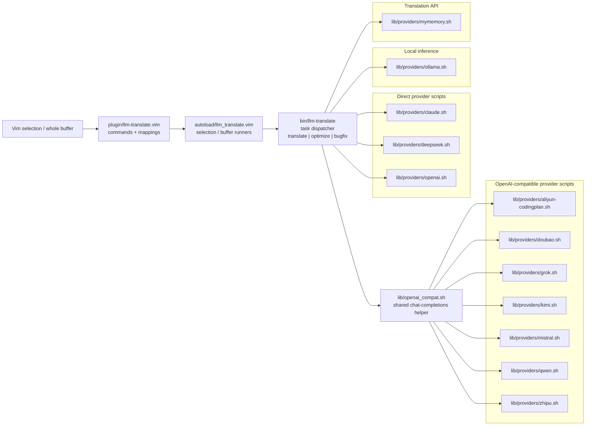

# Architecture

This document contains the detailed Mermaid architecture diagram for the
repository. Regenerate the diagram from the current repository layout with:

```bash
./scripts/render-readme-diagrams.sh
```

The script rewrites only the section between the markers below.

<!-- ARCHITECTURE_MERMAID:START -->

<!-- ARCHITECTURE_MERMAID:END -->
