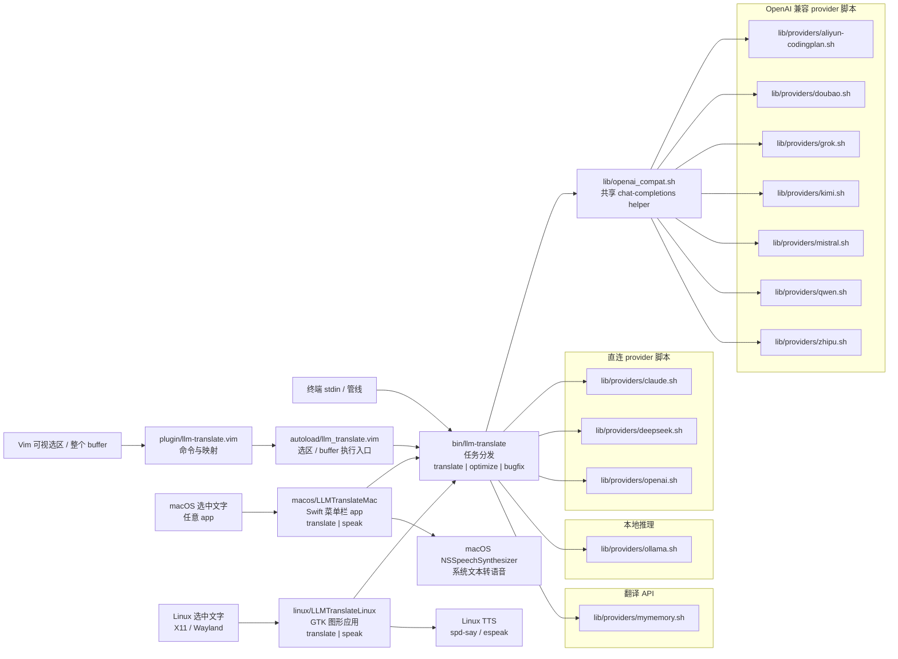

# 架构图

这个文档放仓库的详细 Mermaid 架构图。根据当前仓库结构重新生成：

```bash
./scripts/render-readme-diagrams.sh
```

脚本只会重写下面标记之间的内容。

<!-- ARCHITECTURE_MERMAID:START -->

```mermaid
flowchart LR
  Terminal["终端 stdin / 管线"]
  Input["Vim 可视选区 / 整个 buffer"]
  Plugin["plugin/llm-translate.vim\n命令与映射"]
  Autoload["autoload/llm_translate.vim\n选区 / buffer 执行入口"]
  MacInput["macOS 选中文字\n任意 app"]
  MacApp["macos/LLMTranslateMac\nSwift 菜单栏 app\ntranslate | speak"]
  Speech["macOS NSSpeechSynthesizer\n系统文本转语音"]
  LinuxInput["Linux 选中文字\nX11 / Wayland"]
  LinuxHelper["linux/LLMTranslateLinux\nGTK 图形应用\ntranslate | speak"]
  LinuxSpeech["Linux TTS\nspd-say / espeak"]
  CLI["bin/llm-translate\n任务分发\ntranslate | optimize | bugfix"]
  Compat["lib/openai_compat.sh\n共享 chat-completions helper"]
  Terminal --> CLI
  Input --> Plugin --> Autoload --> CLI
  MacInput --> MacApp --> CLI
  MacApp --> Speech
  LinuxInput --> LinuxHelper --> CLI
  LinuxHelper --> LinuxSpeech
  subgraph direct["直连 provider 脚本"]
    direct_claude["lib/providers/claude.sh"]
    direct_deepseek["lib/providers/deepseek.sh"]
    direct_openai["lib/providers/openai.sh"]
  end
  subgraph compat_group["OpenAI 兼容 provider 脚本"]
    compat_group_aliyun_codingplan["lib/providers/aliyun-codingplan.sh"]
    compat_group_doubao["lib/providers/doubao.sh"]
    compat_group_grok["lib/providers/grok.sh"]
    compat_group_kimi["lib/providers/kimi.sh"]
    compat_group_mistral["lib/providers/mistral.sh"]
    compat_group_qwen["lib/providers/qwen.sh"]
    compat_group_zhipu["lib/providers/zhipu.sh"]
  end
  subgraph local["本地推理"]
    local_ollama["lib/providers/ollama.sh"]
  end
  subgraph translation["翻译 API"]
    translation_mymemory["lib/providers/mymemory.sh"]
  end
  CLI --> Compat
  CLI --> direct_claude
  CLI --> direct_deepseek
  CLI --> direct_openai
  CLI --> local_ollama
  CLI --> translation_mymemory
  Compat --> compat_group_aliyun_codingplan
  Compat --> compat_group_doubao
  Compat --> compat_group_grok
  Compat --> compat_group_kimi
  Compat --> compat_group_mistral
  Compat --> compat_group_qwen
  Compat --> compat_group_zhipu
```
<!-- ARCHITECTURE_MERMAID:END -->
